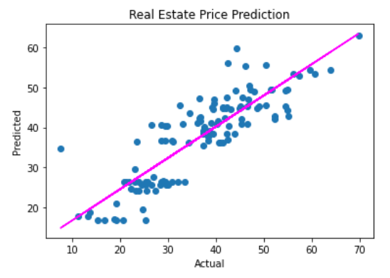
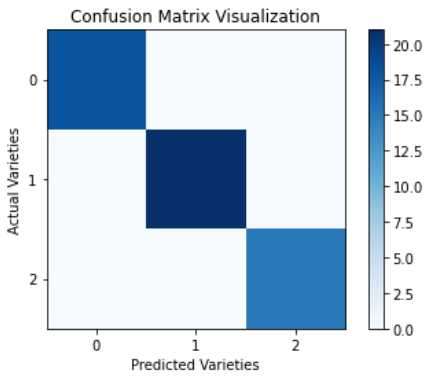
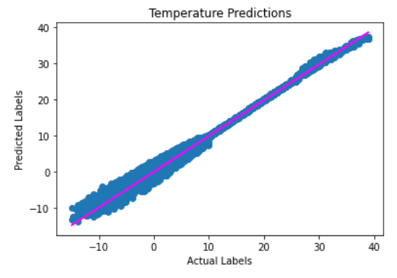

# [Nelson's Portfolio Site](https://github.com/NJLDVera/Portfolio_Site)

Welcome! This is a site made to showcase my projects(Mainly Data Science).

## Azure's DP-100 Project Showcase

This section is designed to showcase my solutions from Azure's DP-100 coding challenges with Python. Solutions are presented thru Jupyter Notebook.

**[Project 1: Azure's Real Estate Price Prediction Challenge](https://github.com/NJLDVera/DP100RealEstateChallenge)**

* This is a programming challenge that seeks to predict property prices based on different factors.
* Cleansed the data to make it suitable for data analysis.
* Explored the data using Matplotlib library to see relevant features in the dataset.
* Built ML Pipeline using scikit-learn to scale feature values. 
* Used gradientboostingregressor as the ML algorithm.
* Achieved 6.18 RMSE score with minimal tuning.

**[Project 2: Azure's Wine Classification Challenge](https://github.com/NJLDVera/DP100WineClassificationChallenge)**

* This is a programming challenge that tasks the user to predict what wine variety based on multiple factors.
* Cleansed the data to make it suitable for data analysis.
* Explored the data using Matplotlib library to see relevant features in the dataset.
* Built ML Pipeline using scikit-learn to scale feature values. 
* Used RandomForestClassifier as the ML algorithm.
* Achieved 1.0 score in all relevant metrics(Accuracy, Precision, Recall, f1-score).
* Saved the model as pkl file.

## Personal Projects

This section is dedicated for my personal projects

**[Project 1: Szeged Apparent Apparent Temperature Predictor](https://github.com/NJLDVera/Szeged_Weather)**

* This is a programming challenge that seeks to predict the apparent temperature of Szeged, Hungary.
* Cleansed the data to make it suitable for data analysis.
* Explored the data using Matplotlib library to see relevant features in the dataset.
* Built ML Pipeline using scikit-learn to scale feature values. 
* Used gradientboostingregressor as the ML algorithm.
* Achieved 0.833 RMSE score with minimal tuning.
* Dateset could be obtained [here](https://www.kaggle.com/budincsevity/szeged-weather).

### Support or Contact

Linkedin: www.linkedin.com/in/njldevera/

